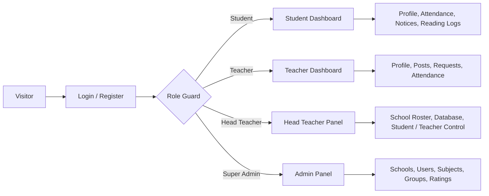

# TutorLink BD - Student Daily Portal

> A modern, role-based school operations portal for Bangladesh, built to keep students, teachers, head teachers, and super admins in clean, separate workflows.

[](https://laravel.com)
[](https://www.mongodb.com/)
[](https://tailwindcss.com)
[](https://vitejs.dev)

## Hero Snapshot

**Built for clean separation, fast workflows, and polished school administration.**

TutorLink BD is designed like a production dashboard, not a plain CRUD app. Every role gets its own workspace, its own navigation, and its own data scope, so the interface stays focused even when multiple portal sessions are active in the same browser.

| Portal | What it feels like |
|---|---|
| Student | A personal academic control room for profile, notices, attendance, logs, and requests |
| Teacher | A teaching workspace for attendance, posts, notices, and student progress |
| Head Teacher | A school-admin console for roster control and school-scoped database review |
| Super Admin | A platform command center for schools, users, subjects, groups, and ratings |

### Quick Links
- [Project Structure](#project-folder-structure)
- [Setup and Build](#setup)
- [Visual Flow](#visual-flow)
- [Testing](#testing)
- [Security and Access Control](#security-and-access-control)

## Overview
TutorLink BD is a role-aware academic management platform designed for schools and colleges. It provides separate dashboards, menu structures, authentication guards, and data scopes so each user only sees the tools that belong to them.

The project is built to feel modern, clear, and fast:
- dashboard-first layout with responsive panels
- smooth drawer navigation and consistent topbar actions
- portal-aware profile handling for multi-login browser sessions
- polished MongoDB-backed data flows for school operations
- role-specific access control for student, teacher, head teacher, and super admin accounts

## Live Experience Snapshot
- Students get a focused space for profile updates, notices, attendance, reading logs, tuition requests, and institute teachers.
- Teachers manage profiles, attendance, notices, tuition posts, and student progress.
- Head teachers control only their own school-scoped roster and database views.
- Super admins manage the full platform: schools, students, teachers, subjects, groups, ratings, and system-wide controls.

## Visual Flow


## Core Features

### Role-Based Access
- Separate session guards for student, teacher, teacher admin, and admin
- Role-aware redirects after login
- Portal-specific navigation and profile links
- Guard-safe logout and profile editing

### Student Portal
- Update personal profile and avatar
- View attendance and institute notices
- Browse institute teachers
- Send tuition or school-related requests
- Track reading logs, leaves, complaints, and payment status

### Teacher Portal
- Maintain professional profile details
- Create tuition posts and review requests
- Manage attendance and student progress
- Share notices and teaching updates

### Head Teacher Portal
- View only school-linked student and teacher records
- Manage school-scoped rosters without mixing other roles
- Search and review login records
- Keep the school database organized and controlled

### Super Admin Portal
- Manage schools, subjects, groups, ratings, students, and teachers
- Review system-wide signups and access patterns
- Maintain platform-wide visibility and governance

### UI and Experience
- Modern dashboard shell with layered gradients and soft glass-like surfaces
- Collapsible sidebar for non-student roles
- Polished avatar handling across profile areas
- Responsive cards, tables, and quick actions for desktop and mobile
- Subtle motion through drawers, hover states, and live feedback patterns

## Technology Stack

### Frontend
- Laravel Blade templates
- Tailwind CSS
- Alpine.js
- Vite asset pipeline

### Backend
- PHP 8.3+
- Laravel 13
- Role-based middleware
- Notification, login review, and school portal controllers

### Database
├── app/
│   ├── Http/
│   │   ├── Controllers/
│   │   │   ├── Controller.php
│   │   │   ├── ProfileController.php
│   │   │   ├── NotificationController.php
│   │   │   ├── ParentPortalController.php
│   │   │   ├── SchoolPortalController.php
│   │   │   ├── Auth/
│   │   │   │   ├── AuthenticatedSessionController.php
│   │   │   │   ├── ConfirmablePasswordController.php
│   │   │   │   ├── EmailVerificationNotificationController.php
│   │   │   │   ├── EmailVerificationPromptController.php
│   │   │   │   ├── NewPasswordController.php
│   │   │   │   ├── PasswordController.php
│   │   │   │   ├── PasswordResetLinkController.php
│   │   │   │   ├── RegisteredUserController.php
│   │   │   │   └── VerifyEmailController.php
│   │   │   ├── Admin/
│   │   │   │   ├── AdminDashboardController.php
│   │   │   │   ├── AdminStudentController.php
│   │   │   │   ├── AdminTeacherController.php
│   │   │   │   ├── ManageGroupController.php
│   │   │   │   ├── ManageRatingController.php
│   │   │   │   ├── ManageSchoolController.php
│   │   │   │   ├── ManageStudentController.php
│   │   │   │   ├── ManageSubjectController.php
│   │   │   │   └── ManageTeacherController.php
│   │   │   ├── Frontend/
│   │   │   │   ├── HomeController.php
│   │   │   │   ├── SchoolController.php
│   │   │   │   └── TeacherController.php
│   │   │   ├── Student/
│   │   │   │   ├── StudentAttendanceController.php
│   │   │   │   ├── StudentDashboardController.php
│   │   │   │   ├── StudentInstituteTeacherController.php
│   │   │   │   ├── StudentNoticeController.php
│   │   │   │   ├── StudentProfileController.php
│   │   │   │   ├── StudentProgressHubController.php
│   │   │   │   └── StudentRequestController.php
│   │   │   ├── Teacher/
│   │   │   │   ├── TeacherAttendanceController.php
│   │   │   │   ├── TeacherDashboardController.php
│   │   │   │   ├── TeacherFinderController.php
│   │   │   │   ├── TeacherNoticeController.php
│   │   │   │   ├── TeacherPostController.php
│   │   │   │   ├── TeacherProfileController.php
│   │   │   │   └── TeacherStudentProgressController.php
│   │   │   ├── AdminMiddleware.php
│   │   │   ├── PortalGuardMiddleware.php
│   │   │   ├── StudentMiddleware.php
│   │   │   ├── TeacherAdminMiddleware.php
│   │   │   └── TeacherMiddleware.php
│   │   └── Requests/
│   │       ├── Auth/
│   │       │   └── LoginRequest.php
│   │       ├── ProfileUpdateRequest.php
│   │       └── ...
│   ├── Mail/
│   │   └── PostRequested.php
│   ├── Models/
│   │   ├── Attendance.php
│   │   ├── BlockedIdentity.php
│   │   ├── Complaint.php
│   │   ├── Group.php
│   │   ├── LeaveApplication.php
│   │   ├── LoginReview.php
│   │   ├── Message.php
│   │   ├── Notice.php
│   │   ├── ParentPortalAccess.php
│   │   ├── PaymentConfirmation.php
│   │   ├── Rating.php
│   │   ├── ReadingLog.php
│   │   ├── School.php
│   │   ├── Student.php
│   │   ├── StudentAssignment.php
│   │   ├── StudentExamResult.php
│   │   ├── StudentGoal.php
│   │   ├── StudentProgress.php
│   │   ├── StudentRequest.php
│   │   ├── StudentTask.php
│   │   ├── Subject.php
│   │   ├── Teacher.php
│   │   ├── TeacherPost.php
│   │   └── User.php
│   ├── Notifications/
│   │   └── PostRequestedNotification.php
│   ├── Providers/
│   │   └── AppServiceProvider.php
│   └── Support/
│       └── Lists/
├── bootstrap/
│   ├── app.php
│   └── providers.php
├── config/
│   ├── app.php
│   ├── auth.php
│   ├── cache.php
│   ├── database.php
│   ├── filesystems.php
│   ├── logging.php
│   ├── mail.php
│   ├── queue.php
│   ├── services.php
│   └── session.php
├── database/
│   ├── factories/
│   │   └── UserFactory.php
│   ├── migrations/
│   │   ├── 0001_01_01_000000_create_users_table.php
│   │   ├── 0001_01_01_000001_create_cache_table.php
│   │   ├── 0001_01_01_000002_create_jobs_table.php
│   │   ├── 2026_05_22_000000_create_notifications_table.php
│   │   └── 2026_05_30_180857_add_missing_fields_to_users_table.php
│   └── seeders/
│       └── DatabaseSeeder.php
├── docs/
│   ├── er-diagram.mmd
│   └── use-case-diagram.mmd
├── public/
│   ├── build/
│   ├── index.php
│   ├── robots.txt
│   └── storage/
├── resources/
│   ├── css/
│   │   └── app.css
│   ├── js/
│   │   └── app.js
│   └── views/
│       ├── admin/
│       │   ├── dashboard.blade.php
│       │   ├── groups/
│       │   │   ├── form.blade.php
│       │   │   └── index.blade.php
│       │   ├── head-teachers/
│       │   │   └── index.blade.php
│       │   ├── ratings/
│       │   │   ├── form.blade.php
│       │   │   └── index.blade.php
│       │   ├── schools/
│       │   │   ├── form.blade.php
│       │   │   └── index.blade.php
│       │   ├── students/
│       │   │   ├── form.blade.php
│       │   │   └── index.blade.php
│       │   ├── subjects/
│       │   │   ├── form.blade.php
│       │   │   └── index.blade.php
│       │   └── teachers/
│       │       ├── form.blade.php
│       │       └── index.blade.php
│       ├── auth/
│       ├── components/
│       ├── dashboard.blade.php
│       ├── emails/
│       ├── frontend/
│       ├── layouts/
│       │   ├── app.blade.php
│       │   ├── footer.blade.php
│       │   ├── guest.blade.php
│       │   ├── navigation.blade.php
│       │   └── partials/
│       │       ├── nav-links-admin.blade.php
│       │       ├── nav-links-admin-responsive.blade.php
│       │       ├── nav-links-student.blade.php
│       │       ├── nav-links-student-responsive.blade.php
│       │       ├── nav-links-teacher.blade.php
│       │       ├── nav-links-teacher-responsive.blade.php
│       │       ├── nav-links-teacher-admin.blade.php
│       │       └── nav-links-teacher-admin-responsive.blade.php
│       ├── notifications/
│       │   └── index.blade.php
│       ├── parent/
│       ├── portal/
│       ├── profile/
│       │   ├── edit.blade.php
│       │   └── partials/
│       │       ├── delete-user-form.blade.php
│       │       ├── update-password-form.blade.php
│       │       └── update-profile-information-form.blade.php
│       ├── student/
│       │   ├── attendance/
│       │   ├── dashboard.blade.php
│       │   ├── institute-teachers/
│       │   ├── notices/
│       │   ├── profile-create.blade.php
│       │   ├── progress-hub/
│       │   └── requests.blade.php
│       ├── teacher/
│       │   ├── attendance/
│       │   ├── dashboard.blade.php
│       │   ├── index.blade.php
│       │   ├── notices/
│       │   ├── posts/
│       │   ├── profile.blade.php
│       │   └── progress/
│       ├── teacher_admin/
│       │   ├── dashboard.blade.php
│       │   ├── database/
│       │   ├── students/
│       │   └── teachers/
│       └── welcome.blade.php
├── routes/
│   ├── auth.php
│   ├── console.php
│   └── web.php
├── screenshots/
├── storage/
│   ├── app/
│   ├── framework/
│   └── logs/
├── tests/
│   ├── Feature/
│   │   ├── AdminDashboardTest.php
│   │   ├── AdminRosterFilterTest.php
│   │   ├── ExampleTest.php
│   │   ├── MultiGuardSessionTest.php
│   │   ├── ProfileTest.php
│   │   └── Auth/
│   └── TestCase.php
├── artisan
├── composer.json
├── package.json
├── phpunit.xml
├── postcss.config.js
├── tailwind.config.js
├── vite.config.js
└── README.md
```

### Focused View Maps

#### `resources/views/portal`
These files power the shared portal utility screens used by student, teacher, parent, and school workflows.

```text
resources/views/portal/
├── complaints.blade.php
├── head-search.blade.php
├── leaves.blade.php
├── login-reviews.blade.php
├── messages.blade.php
├── payments.blade.php
├── reading-logs.blade.php
└── school-members.blade.php
```

#### `screenshots`
Repository UI preview assets live here.

```text
screenshots/
├── home_page.png
├── login_page.png
├── register_page.png
├── student_dashboard1.png
├── student_dashboard2.png
├── student_dashboard3.png
├── student_dashboard4.png
├── student_dashboard5.png
├── student_dashboard6.png
├── student_dashboard7.png
├── student_dashboard8.png
├── student_dashboard9.png
└── student_dashboard10.png
```

#### `storage`
Runtime files, cache, and logs are stored here during local development and production.

```text
storage/
├── app/
├── framework/
└── logs/
```

## Architecture Notes
- `routes/web.php` contains the portal routing map and dashboard redirects.
- `bootstrap/app.php` registers role middleware aliases.
- `app/Http/Requests/Auth/LoginRequest.php` selects the correct authentication guard by portal.
- `app/Http/Controllers/ProfileController.php` resolves the active guard so profile updates stay on the correct account.
- `resources/views/layouts/app.blade.php` and `resources/views/layouts/navigation.blade.php` provide the shared authenticated shell.

## Setup

### Requirements
- PHP 8.3+
- Composer
- Node.js 18+
- npm
- MongoDB server

### Install
```bash
composer install
npm install
cp .env.example .env
php artisan key:generate
```

### Configure `.env`
Set your database and app values before running the app.

```env
APP_NAME="TutorLink BD"
APP_URL=http://localhost:8000
DB_CONNECTION=mongodb
DB_HOST=127.0.0.1
DB_PORT=27017
DB_DATABASE=tutorlink_bd
DB_USERNAME=
DB_PASSWORD=
FILESYSTEM_DISK=public
```

### Build and Run Commands
```bash
# Prepare the application
composer install
npm install
cp .env.example .env
php artisan key:generate

# Database and seed data
php artisan migrate
php artisan db:seed

# Development mode
npm run dev
php artisan serve

# Production build
npm run build

# Run tests
php artisan test
```

## Testing
Run the full test suite:
```bash
php artisan test
```

Useful focused checks:
```bash
php artisan test --filter=ProfileTest
php artisan test --filter=MultiGuardSessionTest
php artisan test --filter=AdminRosterFilterTest
```

## Security and Access Control
- CSRF-protected forms
- Password hashing through Laravel
- Guard-aware multi-session handling
- School-level ownership checks for admin workflows
- Role middleware enforcement on protected routes

## Screenshots
If available in your workspace, preview assets live in `screenshots/`.

Suggested captures:
- home page
- login page
- student dashboard
- teacher dashboard
- head teacher panel
- super admin panel

## Roadmap
- Student progress analytics dashboard
- Exam result and performance trends
- Parent or guardian portal
- Better messaging and notification workflows
- More visual insights for school-level operations

## Author
Sayed Tauhidul Islam

## License
This project is maintained for academic and product development purposes.
